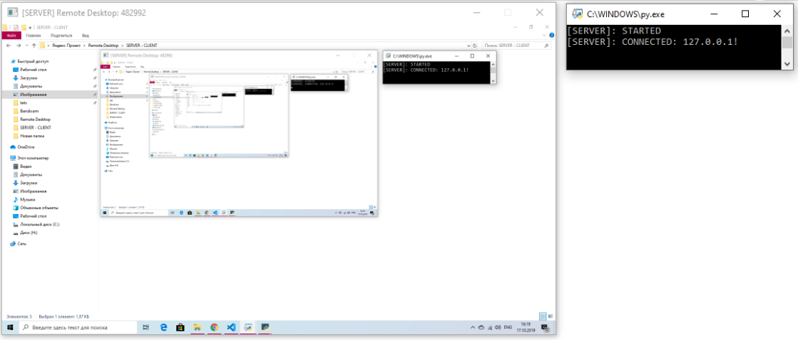

# Remote Desktop on Python
Description: The software is written in Python using various libraries such as: PyQt5, numpy, socket, threading.
What plans do you have for the future? 
It is planned to add various functions such as: mouse control, keyboard control, computer manipulation such as shutdown and reboot.
# version 0.1.2
> What's new?
>> Added continuous screen processing and sending it to the server
> What is planned in the next versions? 
>> Adding a smoother picture.
> Цитата (уровень 1)    
> Продолжение цитаты (уровень 1)  
> Продолжение цитаты (уровень 1)    
# Screens
CLIENT:

SERVER:

